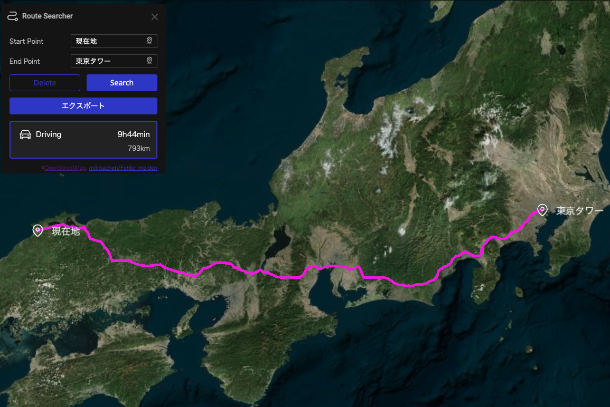
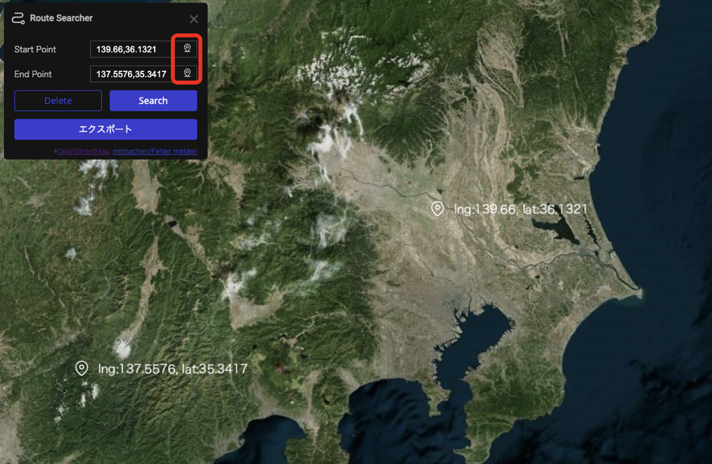
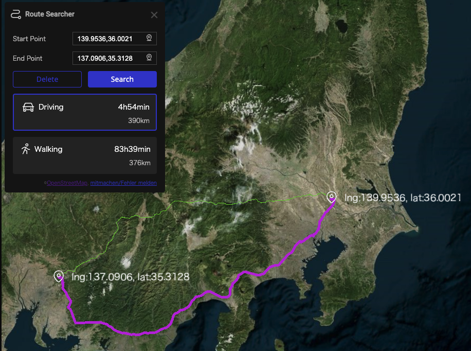

# ルート検索プラグイン

## 概要

OSRM([Open Source Routing Machine](https://project-osrm.org/))の API を利用し、日本国内の任意の 2 地点間の経路を表示するプラグインです。交通手段ごとに、所要時間や距離も表示することが可能です。

## 使用方法

### 編集画面での事前準備

- 事前に右サイドメニュー「API」「移動手段」の設定が必要です。
  
- 本プラグインではユーザご自身でサーバを構築して利用することを推奨していますが、OSRM サーバを使用することも可能です。OSRM のサーバを使用する場合、以下のように設定してください。
  - サーバ：https://routing.openstreetmap.de/
  - パラメータ：?overview=false&geometries=geojson&steps=true
  - 移動手段：自動車 or 自転車 or 徒歩
  - 移動手段では交通手段、経路のカラーを変更することができます。
- OSRM を利用する際の注意点
  - サーバーの負荷を軽減するために、1 秒あたり 1 回の検索に留めてください。
  - ライセンスの関係上、営利目的で本プラグインを使用することはご遠慮ください。ライセンスの詳細は[こちら](https://www.openstreetmap.org/copyright)を参照してください。
- 「スタート地点サムネイル」「ゴール地点サムネイル」に画像ファイルを設定できます。
  

### プラグインの操作方法

- プラグインをインストールし有効化すると、スタート/ゴール地点の入力フォームが表示されます.
  
- 地図上左上のアイコン（上図での赤枠部分）をクリックして、フォームを表示してください。
- フォームには正式な地名やランドマークの名称を入力してください。正確な検索ができない場合があります。(悪い例：東京、良い例：東京都/東京タワー)
- 「現在地」と入力すると、現在地からの経路を検索できます。なお、ブラウザの現在地設定を有効にする必要があります。
  
- プラグインの位置情報アイコンをクリックした上で地図上をクリックすると、その地点の座標を入力することができます。
  
- Search ボタンをクリックすると、2 地点間の経路が表示されます。
  
- Delete ボタンをクリックすることで、経路表示を削除できます。

## 備考

このプラグインは、以下の OS,ブラウザで動作確認をしています。

- OS

  - Mac OS Ventura 13.1

- ブラウザ
  - Chrome: 119.0.6045.123

## 開発者欄

このプラグインは、Re:Earth 公式プラグインです。

ソースコードはこちら(https://github.com/eukarya-inc/reearth-plugin-route-searcher)

- コミュニティ

  - このプラグインを利用したプロジェクトをユーザーコミュニティでシェアしましょう。

  - このプラグインについての不明点がある場合にもここから Re:Earth チームや他の開発者に質問することができます。

  - Discord へのリンクはこちら(https://discord.gg/BXcQhvwqqM)
